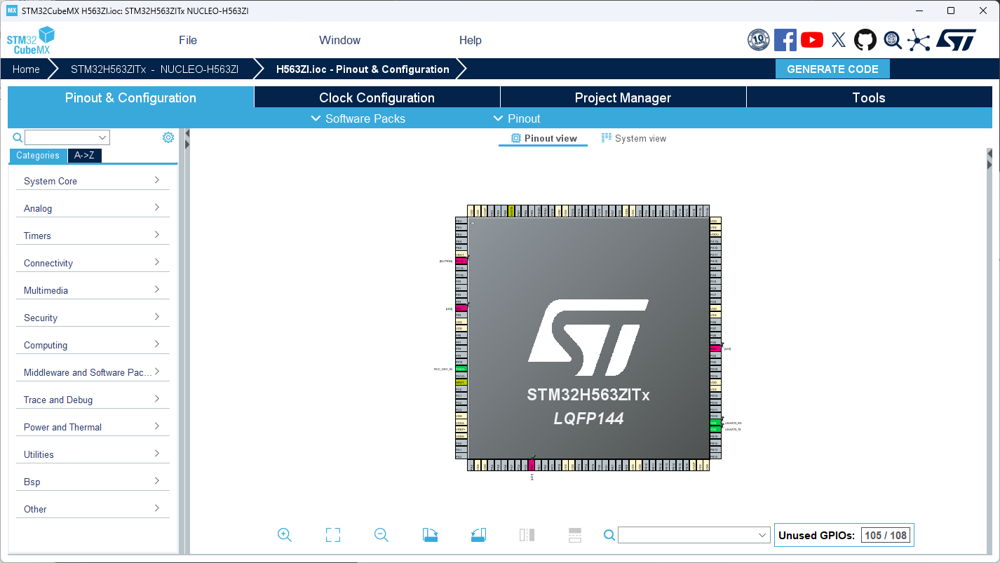
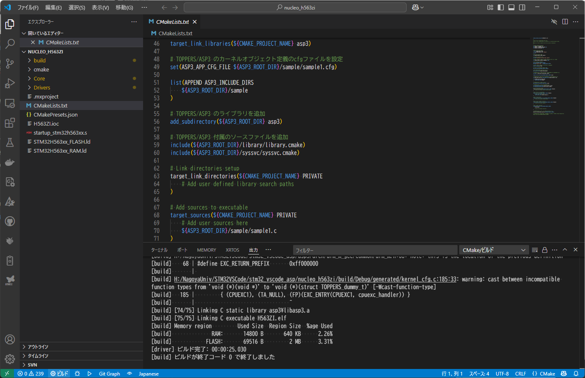

# TOPPERS/ASP3 の STM32 CubeMX向け環境

TOPPERS/ASP3の開発を[Visual Studio Code](https://code.visualstudio.com/)の[STM32 VS Code Extension](https://marketplace.visualstudio.com/items?itemName=stmicroelectronics.stm32-vscode-extension)で行えるようにした環境です。
下記のURLの「Nucleo L552ZE-Q 簡易パッケージ」に TOPPERS/ASP3 Ver.3.7.1 を適用し、CMakeでビルド出来るよう更新したものです。

<https://www.toppers.jp/asp3-e-download.html>

現在 TECS には対応出来ていません。

## ビルド方法

### STM32 CubeMX でコード生成

下記のURLから STM32 CubeMX をダウンロードし、インストールします。

<https://www.st.com/ja/development-tools/stm32cubemx.html>

`nucleo_h563zi/H563ZI.ioc`を STM32 CubeMX で開いて、右上にある`GENERATE CODE`ボタンを押下します。

ビルドに必要なコードが生成されます。
既存のコードの変更点はマージされて出力されます。

### Visual Studio Code の CMake拡張機能でビルド

Visual Studio Code で、`nucleo_h563zi`フォルダを開いて、下のステータスバーの左にある「ビルド」を押します。

