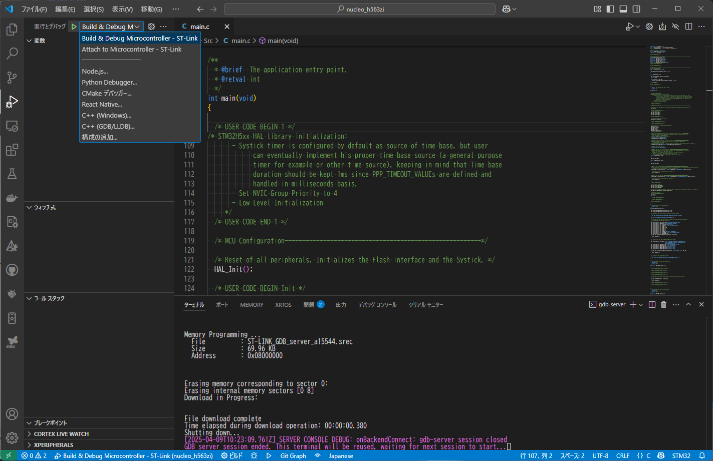
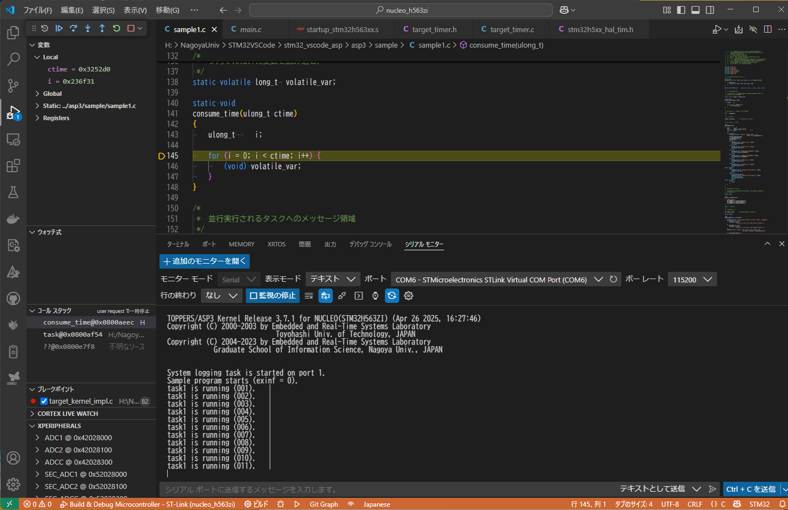
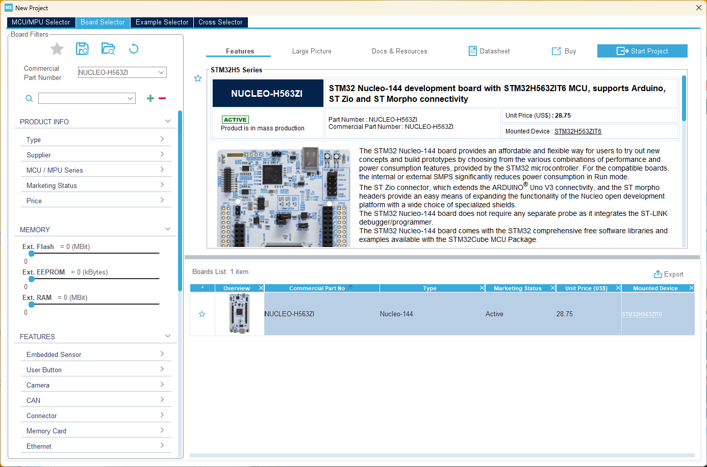
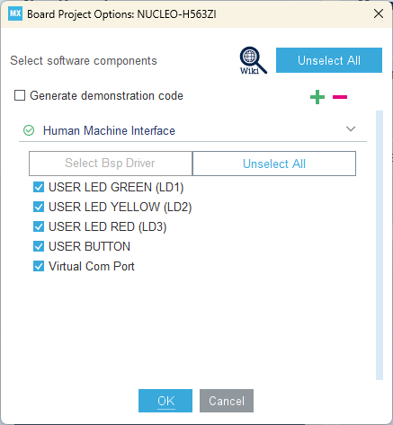
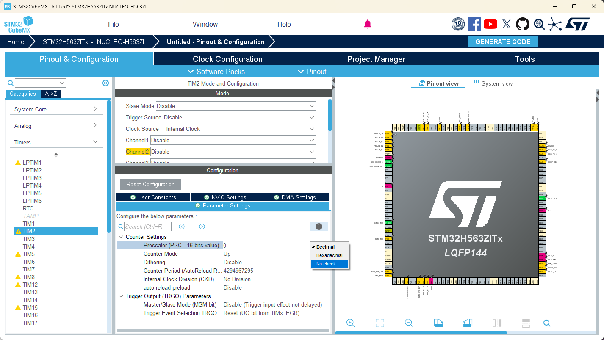
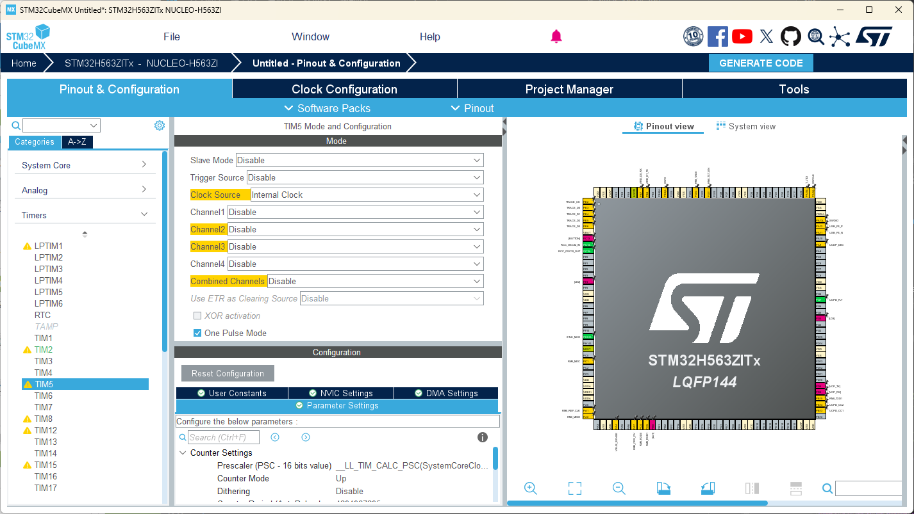
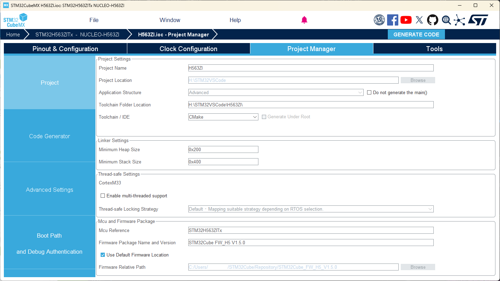

# TOPPERS/ASP3 の STM32 CubeMX向け環境

TOPPERS/ASP3 の開発を[Visual Studio Code](https://code.visualstudio.com/)の[STM32 VS Code Extension](https://marketplace.visualstudio.com/items?itemName=stmicroelectronics.stm32-vscode-extension)で行えるようにした環境です。
下記のURLの「Nucleo L552ZE-Q 簡易パッケージ」に TOPPERS/ASP3 Ver.3.7.1 を適用し、CMakeでビルド出来るよう更新したものです。

<https://www.toppers.jp/asp3-e-download.html>

現在 TECS には対応出来ていません。

## ビルド方法

### STM32 CubeMX でコード生成

下記のURLから STM32 CubeMX をダウンロードし、インストールします。

<https://www.st.com/ja/development-tools/stm32cubemx.html>

`nucleo_h563zi/H563ZI.ioc`を STM32 CubeMX で開いて、右上にある`GENERATE CODE`ボタンを押下します。


ビルドに必要なコードが生成されます。
既存のコードの変更点はマージされて出力されます。

### Visual Studio Code の CMake拡張機能でビルド

Visual Studio Code で、`nucleo_h563zi`フォルダを開いて、下のステータスバーの左にある「ビルド」を押します。


### Visual Studio Code でのデバッグ

'STM32 VS Code Extension'の'Create empty project'で作成した際の設定ファイルが`nucleo_h563zi/.vscode`にあります。
Visual Studio Code の「実行とデバッグ」から`Build & Debug Microcontroller - ST-Link`を選んで「デバッグの開始」ボタンを押してください。



デバッグ起動に失敗した場合、ST-Linkのファームウェアアップデートが必要な場合があります。
下記のサイトからアップデートツールをダウンロードして、ST-Linkのファームウェアをアップデートしてください。

<https://www.st.com/ja/development-tools/stsw-link007.html>

デバッグが開始し、シリアル モニタで`STMicroelectronics STLink Virtual COM Port`を開くと、下記のように表示されます。



## 新しいプロジェクトの作成

### STM32CubeMXの操作

STM32CubeMXから新しいプロジェクトを作成する方法を説明します。

STM32CubeMXを起動して、メニューの「File」→「New Project」を選択します。



1. 上部の「Board Selector」タブを表示します。
2. 「Commercial Part Number」に「NUCLEO-H563ZI」を入力し、右下の検索結果から「NUCLEO-H563ZI」を選択します。
3. 右上の「Start Project」ボタンを押します。

この例では「Trust Zoom」は無効のまま続けています。
下記のダイアログはそのまま「OK」ボタンを押します。



カーネルで必要なタイマ設定を行います。



まず、フリーランニング用タイマ「TIM2」を設定します。

1. 「Timers」の中にある「TIM2」を選択します。
2. 「Clock Source」を「Internal Clock」に変更します。
3. 「Configuration」が表示されるので「Parameter Settings」タブを表示します。
4. 「Prescaler」の横にある歯車マークを押して「No check」を選択します。
5. 「Prescaler」の値を「`__LL_TIM_CALC_PSC(SystemCoreClock, 1000000)`」と入力します。



次に、割込み通知用タイマ「TIM5」を設定します。

1. 「Timers」の中にある「TIM5」を選択します。
2. 「Clock Source」を「Internal Clock」に変更します。
3. 「One Pulse Mode」にチェックを入れます。
4. 「Configuration」が表示されるので「Parameter Settings」タブを表示します。
5. 「Prescaler」の横にある歯車マークを押して「No check」を選択します。
6. 「Prescaler」の値を「`__LL_TIM_CALC_PSC(SystemCoreClock, 1000000)`」と入力します。



プロジェクト設定を入力します。

1. 「Project Name」に任意の名前を入力します。
2. 「Project Location」にプロジェクトファイルを保存するフォルダを選択します。
3. 「Toolchains / IDE」を「CMake」に変更します。

最後に、右上の「GENERATE CODE」を押してコードを生成します。

### TOPPERS/ASP3 を使えるようにする

STM32CubeMXで生成したコードを編集して、TOPPERS/ASP3 付属の「sample1」をビルド、デバッグ出来るようにします。
このリポジトリでは「nucleo_h563zi」フォルダがSTM32CubeMXで生成したコードになります。

このリポジトリにある「asp3」フォルダを、生成したコードのあるフォルダを同レベルに配置します。

#### CMakeList.txtの編集

「CMakeList.txt」を編集し、下記の行を追加して TOPPERS/ASP3 をライブラリとしてビルドする設定を追加します。
追加する箇所は「CMakeList.txt」を参照してください。

```cmake
# TOPPERS/ASP3 の STM32 Cube MX 用のコンパイラ定義をインクルード
include(../asp3/asp3_stm32cubemx.cmake)

# TOPPERS/ASP3 のカーネルオブジェクト定義のcfgファイルを設定
set(ASP3_APP_CFG_FILE ${ASP3_ROOT_DIR}/sample/sample1.cfg)

list(APPEND ASP3_INCLUDE_DIRS
    ${ASP3_ROOT_DIR}/sample
)

# TOPPERS/ASP3 のライブラリを追加
add_subdirectory(${ASP3_ROOT_DIR} asp3)
```

「sample1.c」で依存しているソースファイルをコンパイル対象に追加します。

```cmake
# TOPPERS/ASP3 付属のソースファイルを追加
include(${ASP3_ROOT_DIR}/library/library.cmake)
include(${ASP3_ROOT_DIR}/syssvc/syssvc.cmake)
```

「sample1.c」をプロジェクトのコンパイル対象に追加します。

```cmake
# Add sources to executable
target_sources(${CMAKE_PROJECT_NAME} PRIVATE
    # Add user sources here
    ${ASP3_ROOT_DIR}/sample/sample1.c
)
```

「asp3」ライブラリをリンク対象に追加します。

```cmake
# Add linked libraries
target_link_libraries(${CMAKE_PROJECT_NAME}
    stm32cubemx

    # Add user defined libraries
    asp3
)
```

#### リンカスクリプトの編集

「STM32H563xx_FLASH.ld」と「STM32H563xx_RAM.ld」を編集します。

割り込みベクタは TOPPERS/ASP3 を利用するようになっていますので、`.vector`というセクション名を`.isr_vector`の中に定義します。

```ld
.isr_vector :
{
  . = ALIGN(4);
  KEEP(*(.vector))
  KEEP(*(.isr_vector)) /* Startup code */
  . = ALIGN(4);
} >RAM
```

STM32CubeMXで生成される割り込みベクタ`.isr_vector`は「`startup_stm32h563xx.s`」で定義されていますが、カーネルが起動した後は使用されません。

#### main.cの編集

`main`関数から、カーネルを起動するため`sta_ker`の呼び出しを追加します。

ます、インクルード設定を追加します。
`#include "target_kernel.h"`に`sta_ker`の定義があります。
`#include "stm32h5xx_ll_tim.h"`は、プリスケーラの設定で使用しているマクロの定義を読み込むためにインクルードしています。

```c
/* Includes ------------------------------------------------------------------*/
#include "main.h"

/* Private includes ----------------------------------------------------------*/
/* USER CODE BEGIN Includes */
#include "target_kernel.h"
#include "stm32h5xx_ll_tim.h"
/* USER CODE END Includes */
```

`main`関数の無限ループ`while (1)`に入る前に`sta_ker();`を追加しカーネルを起動します。
ちなみに`sta_ker`は戻ることはありません。

```c
/* Infinite loop */
/* USER CODE BEGIN WHILE */
sta_ker();
while (1)
{

  /* USER CODE END WHILE */

  /* USER CODE BEGIN 3 */
}
/* USER CODE END 3 */
```
